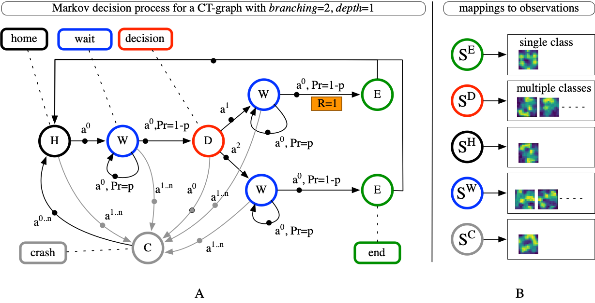
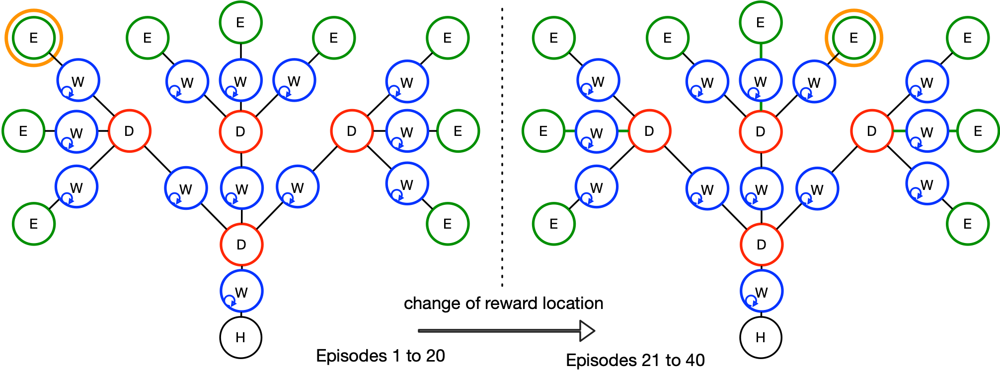

<H1>CT-graph environments - Lifelong Learning Machines (L2M)</H1>

The configurable tree graph (CT-graph): A set of dynamic non-Markov reward-based environments

Copyright (C) 2019-2021 Andrea Soltoggio, Pawel Ladosz, Eseoghene Ben-Iwhiwhu, Jeff Dick.

<b>Objectives</b>

The CT-graph is designed to assess the following RL learning properties:
<ul>
<li>learning with variable and measurable degrees of partial observability;
<li>learning action sequences of adjustable length and increasing memory requirements;
<li>learning with variable and measurable sparsity and frequency of rewards;
<li>learning multiple tasks and testing speed of adaptation (lifelong learning scenarios);
<li>learning multiple tasks where the knowledge of task similarity is a required metrics
(meta-learning or multi-task learning);
<li>testing meta-learning approaches for optimised exploration policies;
<li>learning hierarchical knowledge representation and skill-reuse for fast adaptation to
dynamics rewards (lifelong learning scenarios);
<li>testing attention mechanisms to separate key states from confounding stimuli;
<li>testing associative mechanisms to link key stimuli-action pairs with delayed rewards;
<li>testing neuromodulatory approaches to learn from key stimuli;
<li>learning a model of the environment;
<li>testing the use of selective plasticity mechanisms to enable optimised updates;
<li>ease of computation of lifelong learning metrics;
<li>learning a combination of innate and learned knowledge to cope with invariant and
variant aspects of the environment.
</ul>
          
<b>Installation</b>

pip install -e .

<b>Instructions</b>

Files:

- gym_CTgraph: folder with the CT-graph code.

- test_graph.py: script to the perform basic tests of the CT-graph environments.

- testDimRed.py: script to perform checks on the input image dataset, e.g. dimensionality reduction and visualization with t-SNE.

- ilearn.py: simple script to perform classification on the input image dataset.

Using tensorboad:
tensorboard --logdir='./logs' --port=6707

<b> Example of CT-graph with depth=1</b> 

<b> Example of two CT-graphs with depth=2</b> 

<b>Acknowledgement</b>

This material is based upon work supported by the United States Air Force Research Laboratory (AFRL) and Defense Advanced Research Projects Agency (DARPA) under Contract No. FA8750-18-C-0103.

Any opinions, findings and conclusions or recommendations expressed in this material are those of the author(s) and do not necessarily reflect the views of the United States Air Force Research Laboratory (AFRL) and Defense Advanced Research Projects Agency (DARPA).

<b>License</b>

This program is free software: you can redistribute it and/or modify it under the terms of the GNU General Public License as published by the Free Software Foundation, either version 3 of the License, or (at your option) any later version.

This program is distributed in the hope that it will be useful, but WITHOUT ANY WARRANTY; without even the implied warranty of MERCHANTABILITY or FITNESS FOR A PARTICULAR PURPOSE.  See the GNU General Public License for more details.

You should have received a copy of the GNU General Public License along with this program.  If not, see <https://www.gnu.org/licenses/>.
